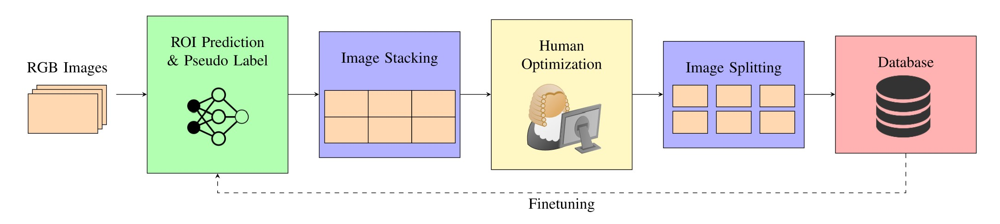

# MV-ROI: Multi-View ROI Prediction and Annotation

[](https://github.com/hofbi/mv-roi)
[](https://github.com/hofbi/mv-roi)
[](https://github.com/psf/black)

## Installation

Setup the annotation framework environment

```shell
make setup
```

Read the [bdda setup](bdda#setup-the-vnvironment) for how to setup the BDD-A model.

## Dataset

[Download](https://mediatum.ub.tum.de/1548761) the MV-ROI dataset.

* Use our [dataset extractor](annotation#extract-data) to export image and label files from the dataset.
* Prepare the data for training the bdda model with the [prepare](bdda#prepare) module or directly use our finetuned weights in `bdda/weights`.

## Annotation



General workflow of the annotation framework.

1. **Data Generation:** Use your own data and record from CARLA with our [record](record) module.
1. **Data Format (Optional):** Data require [this](annotation#naming-convention) format. Details for reindexing [here](annotation#reindex).
1. **Data Preparation:** Prepare the data to be used by the bdda model with the [prepare](bdda#prepare) module.
1. **Model Prediction:** Generate ROI predictions for the data using the [finetuned model](bdda#prediction).
1. **Reformat Data:** Reformat the data from bdda naming conventions to ours to be used in the further pipeline with the [reformat](bdda#reformat) module.
1. **Pseudo Label Generation:** [Generate](annotation#generate-pseudo-label) json labels from model predictions.
1. **Merge Samples:** [Merge](annotation#merge) all camera views of a sample
1. **Human Inspection:** Use the tool [labelme](https://github.com/wkentaro/labelme) to manually inspect and manipulate the labels
1. **Split Samples:** [Split](annotation#split) all camera views of a sample
1. **Generate HDF5:** [Generate](annotation#hdf5) HDF5 files from labels and images

For details read the documentation of the [Annotation Framework](annotation), [BDDA Model](bdda) and [Record Module](record).

## Paper

If you use MV-ROI please cite our paper.

*Multi-View Region of Interest Prediction for Autonomous Driving Using Semi-Supervised Labeling, Markus Hofbauer, Christopher B. Kuhn, Jiaming Meng, Goran Petrovic, Eckehard Steinbach; ITSC 2020* [[PDF](https://www.researchgate.net/publication/342171521_Multi-View_Region_of_Interest_Prediction_for_Autonomous_Driving_Using_Semi-Supervised_Labeling)]

```tex
@inproceedings{hofbauer_2020,
    title = {Multi-View Region of Interest Prediction for Autonomous Driving Using Semi-Supervised Labeling},
    booktitle = {23rd IEEE International Conference on Intelligent Transportation Systems (ITSC)},
    publisher = {IEEE},
    author = {Hofbauer, Markus and Kuhn, Christopher B. and Meng, Jiaming and Petrovic, Goran and Steinbach, Eckehard},
    address = {Rhodes, Greece}
    month = sep,
    year = {2020},
    pages = {1--6},
}
```

## Development

```shell
# Run all tests (unit and integration tests)
make test

# Check code (format and pylint checks)
make check

# Apply code format
make format
```
